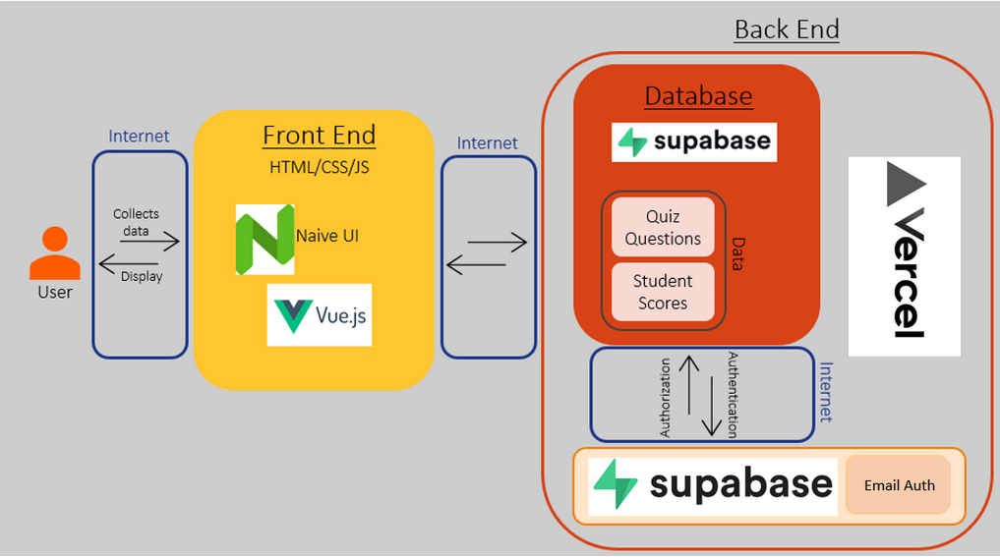

# NCLEX Interactive Quiz

This README will provide an overview of the code repository to help you better understand the code behind the NCLEX Interactive Quiz.

## Table of Contents

In this overview, we will go over the following:

1) [Introduction to the NCLEX Interactive Quiz](#Introduction-to-the-NCLEX-Interactive-Quiz)
2) [Tech Stack](#Tech-Stack)
3) [Architecture Diagram](#Architecture-Diagram)
4) [Website Diagram](#Website-Diagram)
5) [Getting Started with the Project](#Getting-Started-with-the-Project)
    - [Installation Prerequisites](#Installation-Prerequisites)
    - [Installing the Vue CLI](#Installing-the-Vue-CLI)
    - [Important Vue CLI Commands](#Important-Vue-CLI-Commands)
    - [Setting Environment Variables](#Setting-Environment-Variables)
6) [Project Structure](#Project-Structure)
7) [File Descriptions](#File-Descriptions)
8) [User Authentication](#User-Authentication)

## Introduction to the NCLEX Interactive Quiz

The NCLEX Interactive Quiz was originally developed by four students at UNC Chapel Hill as a part of COMP 523 (Software Engineering Lab) in the spring of 2022. This website aims to help UNC School of Nursing students prepare for their NCLEX exams by allowing students to practice with quizzes similar to what they would expect on their actual exams.

The NCLEX Interactive Quiz has 6 different question types:

* Drop Down: These are questions where you need to select the best answer choices from one or more drop downs.
* Drop Down Sentence: These are questions where you need to fill in sentences with the correct words from the given drop downs.
* Highlight Table: These are questions where you need to highlight the correct answer choices in a matrix table.
* Matrix Table: These are questions where you need to select the correct radio buttons in a matrix table.
* Multiple Choice (single response): These are multiple choice questions where students can only select one possible answer.
* Multiple Choice (multiple responses): These are multiple choice questions where students can select as many answer choices as they want (there is no partial credit).

## Tech Stack

Front-End:

* **Vue.js**: Vue.js is an open-source front end JavaScript framework for building single-page applications and user interfaces. Vue.js builds on top of standard HTML, CSS, and JavaScript to allow you to build single-page applications and user interfaces efficiently through the use of component-based programming.
* **HTML/CSS**: HTML and CSS are used throughout the project to structure and style different webpages.
* **Naive UI**: Naive UI is a Vue 3 component library that provides a nice set of components (such as buttons, input fields, etc.) that can make your Vue 3 application look/function better. Naive UI components are commonly used throughout the project.

Back-End:

* **Supabase**: Supabase is an open-source alternative to Firebase that provides a backend SQL database for storing and retrieving data. This is used by the Interactive NCLEX Quiz to store quizzes, user authentication information, student scores, etc.
* **Vercel**: Vercel is a web hosting service that makes it simple to host and deploy websites. Vercel automatically redeploys when changes are pushed to main, so Vercel is relatively low maintenance and automates a lot of deployment processes.

If you aren't already familiar with Vue.js, we have created a tutorial that serves as both an introduction to Vue 3 as well as a demo of Vue 3. Although this tutorial doesn't cover every possible topic on Vue 3, it serves as a great starting point for anybody new to Vue 3, and we highly recommend that you start here if you aren't familiar with it.

[Click here to check out the Vue 3 tutorial.](https://github.com/UNC-NCLEX/Vue-3-Tech-Talk)

## Architecture Diagram

Please refer to the following architecture diagram to get a better sense of how all of the different components of this project fit together.



## Website Diagram

TO BE ADDED

## Getting Started with the Project

In this section, we will go over how you can configure your computer to begin working on the project.

### Installation Prerequisites

Before starting, you need to install Node.js on your computer. Node.js is an open-source, cross-platform JavaScript runtime environment built on Google Chrome's V8 engine. Node.js allows you to execute JavaScript code outside of a web browser and allows you to access the Node Package Manager, which is Node.js's default package manager. This allows you to easily download and install Vue.js packages.

To install Node.js, [click here to visit the Node.js website and install the current version of Node.js](https://nodejs.org/en/).

### Installing the Vue CLI

Open your command line (Terminal in macOS or VS Code, Command Prompt/Powershell in Windows, etc.) and run the following command:

> npm init vue@latest

This will install the latest version of the Vue CLI. It will also execute `create-vue` and allow you to start your first Vue project.

### Important Vue CLI Commands

As you work with the Vue CLI, there are a couple of commands you will likely use frequently. The following are a couple of frequently-used commands you should remember:

* npm install - installs modules defined in package-lock.json
* npm install [insert argument] - installs a specific package
* npm run build - builds your project
* npm run lint - checks source code for programmatic and stylistic errors
* npm run dev - starts a development server
* npm run serve - runs the command defined under the name serve in package.json, which is vue-cli-service serve by default

### Setting Environment Variables

After cloning this repository onto your computer and opening it in your preferred IDE (we recommend Visual Studio Code), you will need to set a couple of environment variables before running the project locally. To do this, you will need to create a new file called ".env" that should be located at the root of your project's directory.

A .env file is a text configuration file that lets you set environment variables for your development environment. For example, in src/supabase.js, the values of supabaseUrl and supabaseAnonKey are pulled from the .env file, and these credentials are used to create a client and securely connect to the database.

**NOTE: The .env file stores sensitive credentials, and as such, must never be uploaded to GitHub or shared publicly. The values of environment variables such as the ANON Key or the Supabase URL must go in the .env file, and if you were to reference these values throughout the project, you must use the variable names from .env rather than the values themselves.**

As of the time of this writing, there are three environment variables:

* VUE_APP_SUPABASE_URL: Contains the URL used to connect to Supabase (similar to a username)
* VUE_APP_SUPABASE_ANON_KEY: Contains the authentication key required to interact with Supabase (similar to a password)
* VUE_APP_UNSPLASH_ACCESS_KEY: Contains the access key for the Unsplash API, which is used to assign each new user a random picture of a dog as their profile image

It's important to note that, in Vue.js, all environment variables must start with VUE_APP_. Otherwise, Vue.js will not recognize the environment variable. Additionally, it's important to keep in mind that environment variables are loaded at build time. Therefore, if you were to add an environment variable when the project is already running, it will not be recognized until after you stop running it and re-run it with `npm run serve`.

Again, your .env file must be located in the root directory of your project, and the file's contents should look like this:

```
VUE_APP_SUPABASE_URL=YOUR_SUPABASE_URL
VUE_APP_SUPABASE_ANON_KEY=YOUR_SUPABASE_ANON_KEY
VUE_APP_UNSPLASH_ACCESS_KEY=YOUR_UNSPLASH_ACCESS_KEY
```

You can retrieve the Supabase URL and ANON Key from Supabase, and you can retrieve the Unsplash access key from Unsplash (login information is provided in a separate document). All you need to do is replace "YOUR_SUPABASE_URL", "YOUR_SUPABASE_ANON_KEY", and YOUR_UNSPLASH_ACCESS_KEY with their corresponding values (do not wrap the values in quotation marks).

## Project Structure

For more information on the general structure of a Vue 3 project, [please refer to the Vue 3 tutorial that we created](https://github.com/UNC-NCLEX/Vue-3-Tech-Talk#Project-Structure=).

In this section, we'll be talking specifically about the contents of the src directory, which contains all of the project's files. The src directory contains the following subdirectories:

* assets - Contains images used on the website, such as the UNC logo or the picture of the Old Well.
* components - Contains different components/widgets that are used throughout the website. The components in this subdirectory are NOT whole webpages, but rather, they can be reused on different webpages.
* router - Contains routing information that allows you to switch between multiple webpages.
* store - Contains state information, such as a logged in user's information or quiz information pulled from Supabase
* unsplash - Contains the unsplashUrl variable, which is used to get a random dog photo from the Unsplash API.
* views - Contains components that act as whole webpages on the website.

There are also two important files inside the src directory:

* App.vue - Root of your Vue application, typically defines the webpage template.
* main.js - Initializes App.vue and is responsible for plugins and 3rd party components.

It's important to understand the difference between the components and views subdirectories. Components contains pieces of your Vue application that can be reused across multiple webpages while views contains components that act are essentially the webpages you would visit. For example, views has a component called HomePage.vue, which is the component that defines the website's home page. Components has a component called DropDown.vue, which is a component that defines a drop down quiz question and can be reused throughout the website. All pages that are routed to in the router must be placed in the views subdirectory.

## File Descriptions

This section will provide an overview of what each file in src/components and src/views is about and what they do.

src/components:

* DropDown: Defines a drop-down quiz question
* DropDownSentence: Defines a drop-down sentence quiz question
* HighlightTable: Defines a highlight table quiz question
* HomePageHeader: Defines the header used only on the website's home page
* InstructionDashboardHeader: Defines the header used for the instructor dashboard page
* MatrixTable: Defines a matrix table quiz question
* MultipleChoice: Defines a multiple choice quiz question
* MultipleResponse: Defines a multiple response quiz question
* PasswordRules: Defines a widget used in the user authentication that displays the criteria for a valid password
* QuizCard: Defines a card widget used at the top of the student dashboard that shows a graphic of the scores that a student got on each quiz they've taken
* QuizzesContainer: Defines a list of quiz buttons that are displayed on the student dashboard. These buttons are created dynamically after pulling the quizzes from Supabase.
* RationalePopup: Defines a widget used to show the rationale behind a quiz question's correct/incorrect answer
* StudentDashboardHeader: Defines the header used for the student dashboard page

src/views:

* HomePage: Defines the home page
* InstructorDashboard: Defines the instructor dashboard
* NewDDS: Defines the page that allows you to create a new drop-down sentence quiz question (found in the add quiz/question section of the instructor dashboard)
* NewDDT: Defines the page that allows you to create a new drop-down table quiz question (found in the add quiz/question section of the instructor dashboard)
* NewHighlight: Defines the page that allows you to create a new highlight quiz question (found in the add quiz/question section of the instructor dashboard)
* NewMatrix: Defines the page that allows you to create a new matrix table quiz question (found in the add quiz/question section of the instructor dashboard)
* NewMultChoice: Defines the page that allows you to create a new multiple choice (single answer) quiz question (found in the add quiz/question section of the instructor dashboard)
* NewSelectAll: Defines the page that allows you to create a new select all (multiple answers) quiz question (found in the add quiz/question section of the instructor dashboard)
* NotFound: Defines the 404 error page that is displayed if someone visits a page that does not exist
* PasswordRecovery: Defines the password recovery page that allows a user to change their password
* QuestionSelect: Defines the add new quiz/question page in the instructor dashboard
* Roster: Defines the roster of active student onyens
* UserAuthentication: Defines the user authentication page that allows users to sign in, sign up, or reset their password
* ViewAllQuizzes: Defines the page that allows the instructor to view all active quizzes in the instructor dashboard

## User Authentication

In this section, we'll go over some important information regarding the website's user authentication (signing in/signing up).

Currently, any new user who signs up will be signed up as a student. Only one account is currently registered as an instructor and that is the account with the email `unc-nclex-site@unc.edu`. Please do not remove this email from Supabase, as the instructor will no longer be able to access the instructor dashboard. If this happens, the code in the user authentication section will have to be updated to allow new users to sign up as an instructor and then the code must be switched back to make new users sign up as a student.

When a new user signs up, a request will be made to the Unsplash API to get a random picture of a dog to use as their profile image. In the future, this can be changed to something else in src/unsplash, but it's important to keep in mind that the Unsplash API has a limit of 50 requests per hour. Therefore, if more than 50 users sign up within an hour, every user after the 50th will not have a profile image.

The instructor dashboard has a roster section with a list of valid student onyens. This list is important, as the only students who will be able to sign up are students whose onyens have already been registered in the roster. If a student tries to sign up and their onyen is not present in the roster, the sign up process will fail. Similarly, if students are removed from the roster after the semester ends, they will no longer be able to log back into the website. At this point, the instructor can choose whether or not they want to remove the previous students's data from Supabase or whether they want to keep records of previous students in Supabase.
